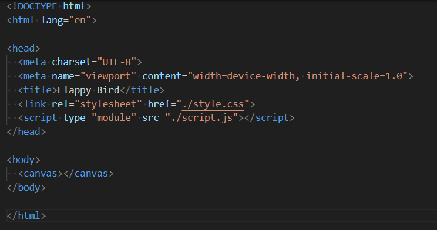
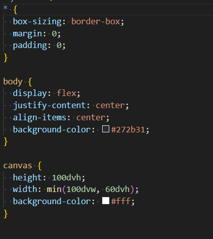
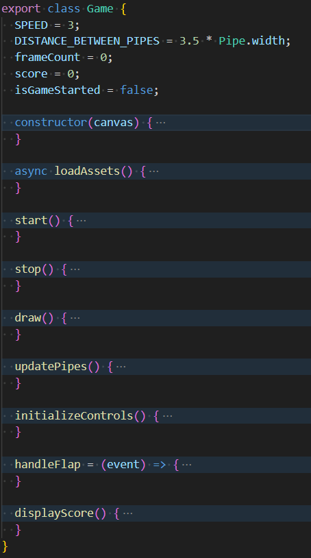
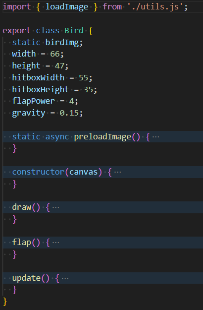
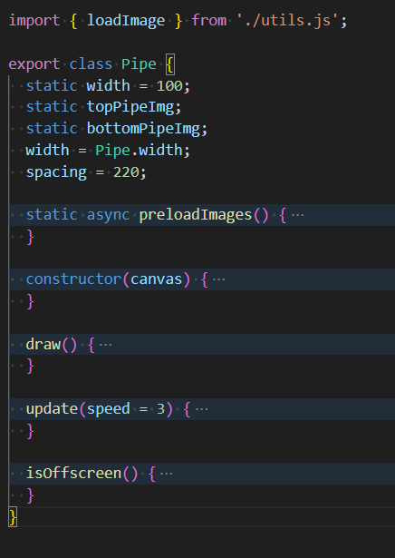
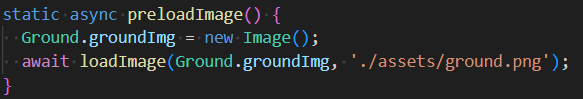
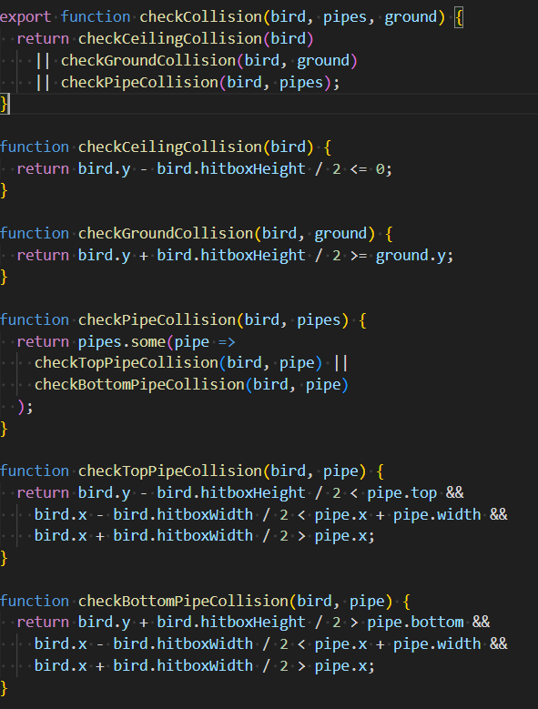
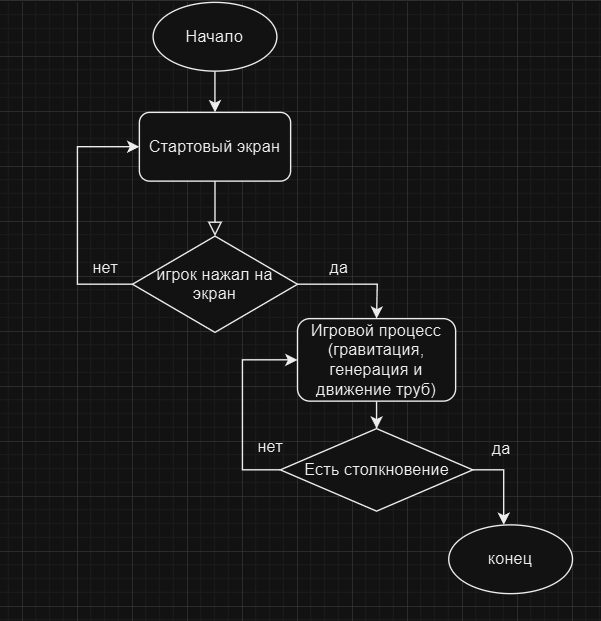
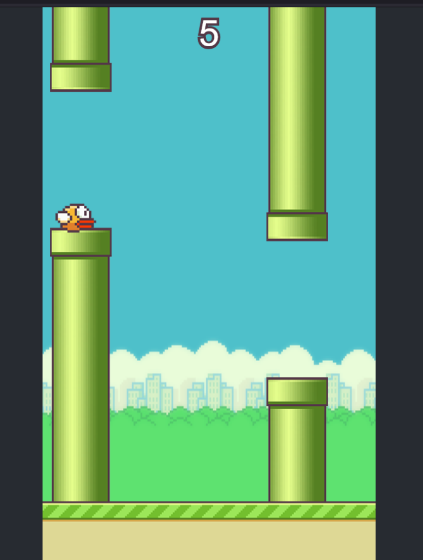

# Полное руководство по созданию Flappy Bird на HTML5 Canvas

## 1. Исследование предметной области

### 1.1 Анализ оригинальной игры
Мы провели детальный анализ механик оригинальной игры:
   - Физика: гравитация и импульсный прыжок.
   - Геймплей: бесконечные препятствия с рандомизированными промежутками.
   - Управление: однотапные действия.
   - Визуал: 2D-спрайты с параллакс-эффектом.
   - Система подсчетов очков.

### 1.2 Выбор технологий
| Технология | Обоснование выбора |
|------------|--------------------|
| HTML5 Canvas | Лучшее решение для 2D-графики в браузере |
| Чистый JavaScript | Минимальные зависимости |
| ООП подход | Четкая структура кода |


### 1.3 Прототипирование
Мы создали 3 прототипа:
1. Базовый движок (птица + 1 труба)
2. Полная физическая модель
3. Финальная версия с графикой

## 2. Техническое руководство

### Пошаговая реализация

1. **Структура файлов.**
```plaintext
/
├── src/
│   ├── index.html
│   ├── style.css
│   ├── script.js
│   ├── game.js
│   ├── bird.js
│   ├── collision.js
│   ├── ground.js
│   ├── pipe.js
│   ├── utils.css
│   └── assets/
│       ├── bird.png
│       ├── bottom-pipe.png
│       ├── top-pipe.png
│       ├── ground.png
│       └── bg.png
```
2. **HTML-каркас.**



3. **Базовый CSS**
   


4. **Создание класса Game**
   


5. **Создание класса Bird**
   


6. **Генерация труб**
    


7. **Загрузка изображений**
    


8. **Система коллизий**
    



## 3. Алгоритм программы



## 4. Модификация игры "Flappy Bird" – Добавление счетчика пройденных препятствий

### Изменения:

1. Введен счетчик "N", который увеличивается каждый раз, когда птица полностью минует пару труб (верхнюю и нижнюю часть).

2. Счетчик отображается на экране игры рядом с основным счетом.




